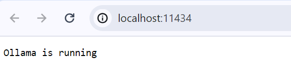

# Using langchain with ollama (Mistral) & python 

Before running the python codes, we need to setup the Ollama server locally.

## Please follows few steps/commands below

Run Ollama docker locally - CPU only
```
docker run -d -v ollama:/root/.ollama -p 11434:11434 --name ollama ollama/ollama
```

Run [model](https://ollama.com/library) locally 
```
docker exec -it ollama ollama run mistral
```

Check with ollama is running local
Go to browser with url http://localhost:11434



## Runing python codes with Ollama

Install external packages / libraries
```
pip install -r .\requirements.txt
```

Run python files
```
python .\langchainwithollama.py
```

